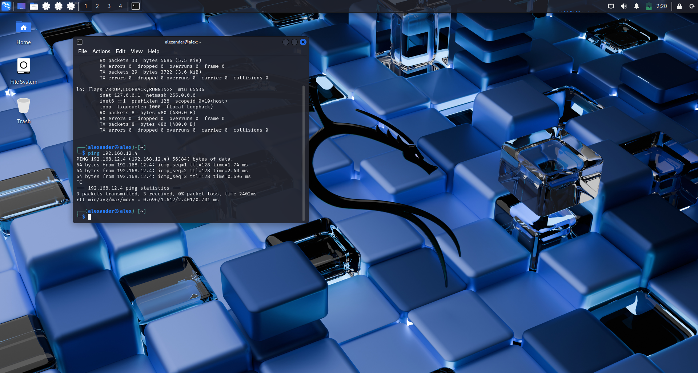
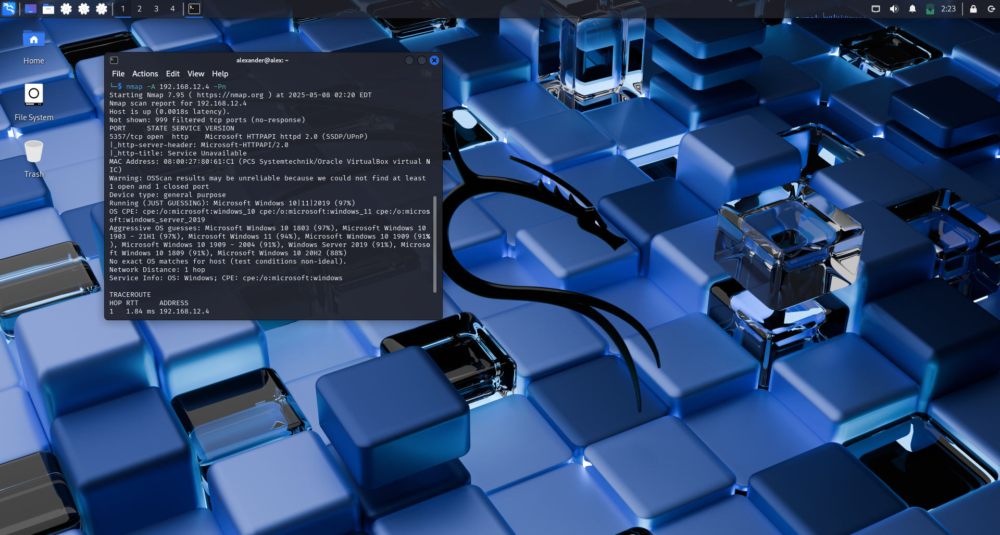
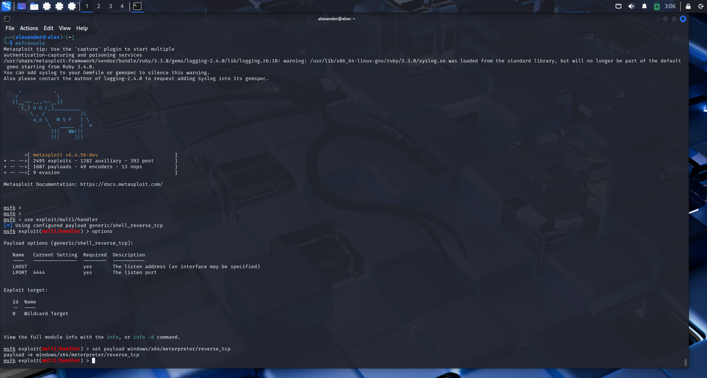
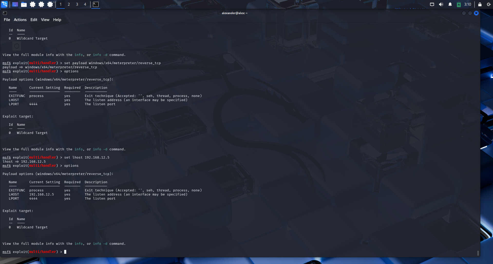
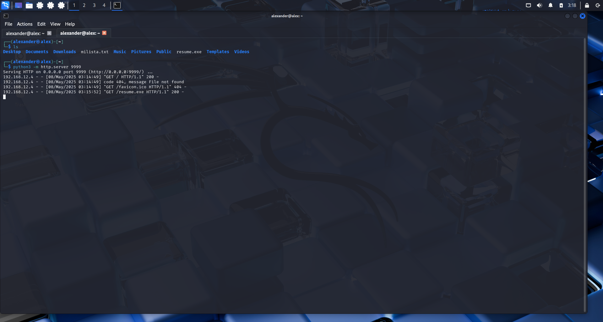
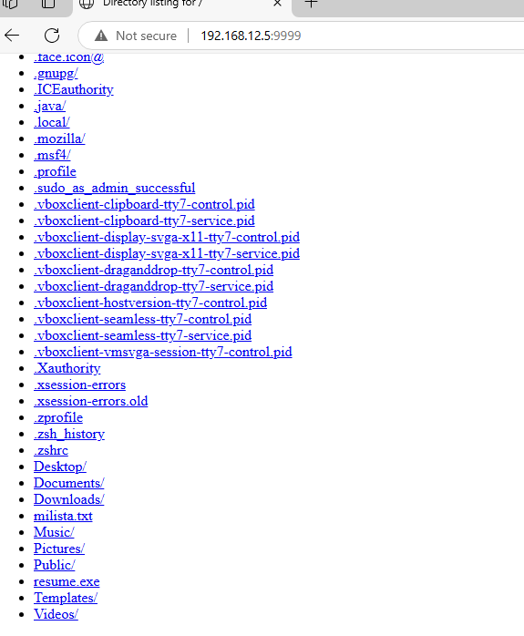
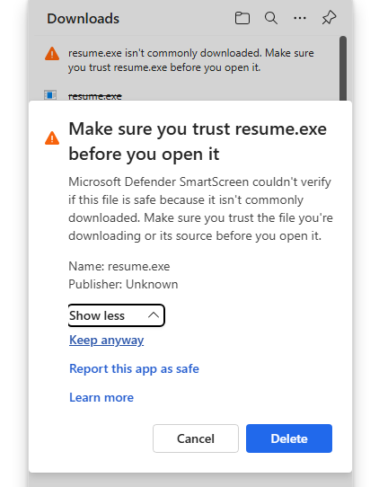
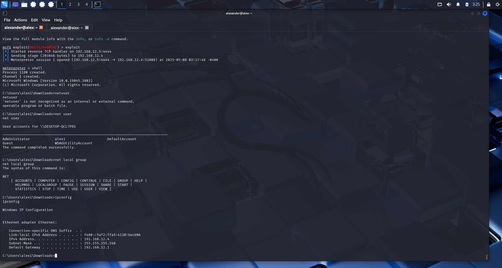

# Attack-Simulation
Attack Simulation with Metasploit and Reverse Shell
# 🧰 Tools Used
Kali Linux (attacker) 🐉
Windows (victim) 🪟
VirtualBox 💻
Metasploit Framework 🎯
Nmap 🔍
Python 3 🐍

# 🧪 Steps Performed
# 1️⃣ Virtual machine setup
Two virtual machines (Kali Linux and Windows) were installed and configured in VirtualBox on the same network.

# 2️⃣ Connectivity check 🛰️
Connectivity between the two machines was verified to ensure they could communicate.

# 3️⃣ Port scanning with Nmap 🔎
Open ports on the Windows machine were identified from the Kali machine.

# 4️⃣ Payload creation with Metasploit 💣
A malicious file was generated to establish a reverse shell when executed.
1-METASPLOIT-FRAMEWORK!

2-SETTING INFO: LH Y LP.

# 5️⃣ Web server setup with Python 🌐
The generated file was hosted via a simple HTTP server to be downloaded by the victim.

# 6️⃣ File download from the victim 📥
The Windows machine accessed the attacker's server and downloaded the payload. However, the system detected it was not a normal file. 

# Part 2

# 7️⃣ Listener setup in Metasploit 🎧
Metasploit was configured to listen for the incoming reverse shell connection. Commands succesfullye executed. 

# 8️⃣ Payload execution and connection established 🔌
Upon execution of the file on Windows, a reverse shell connection was successfully established.

# 9️⃣ Active session exploration 🕵️
Meterpreter commands were used to explore the compromised system and check logs.
